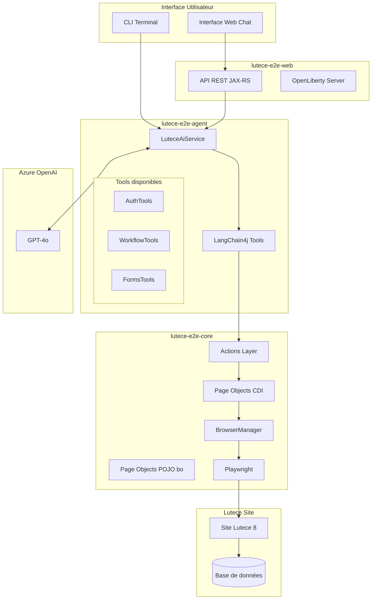
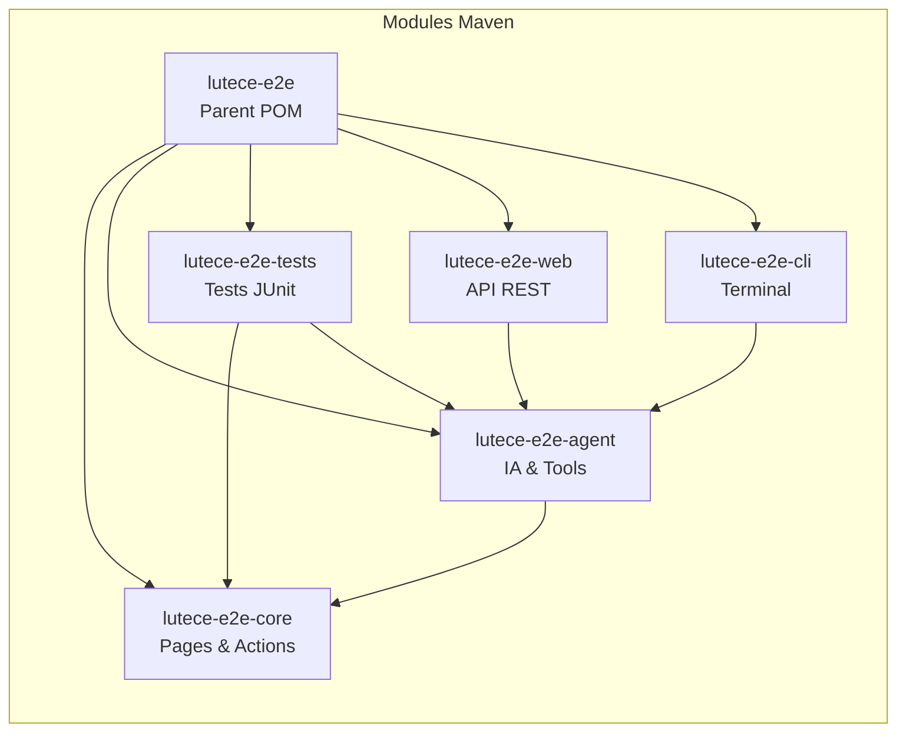
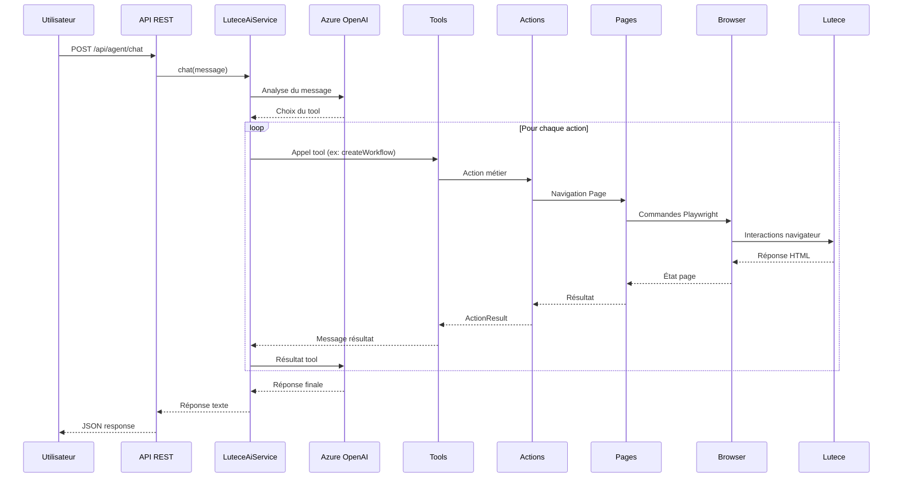
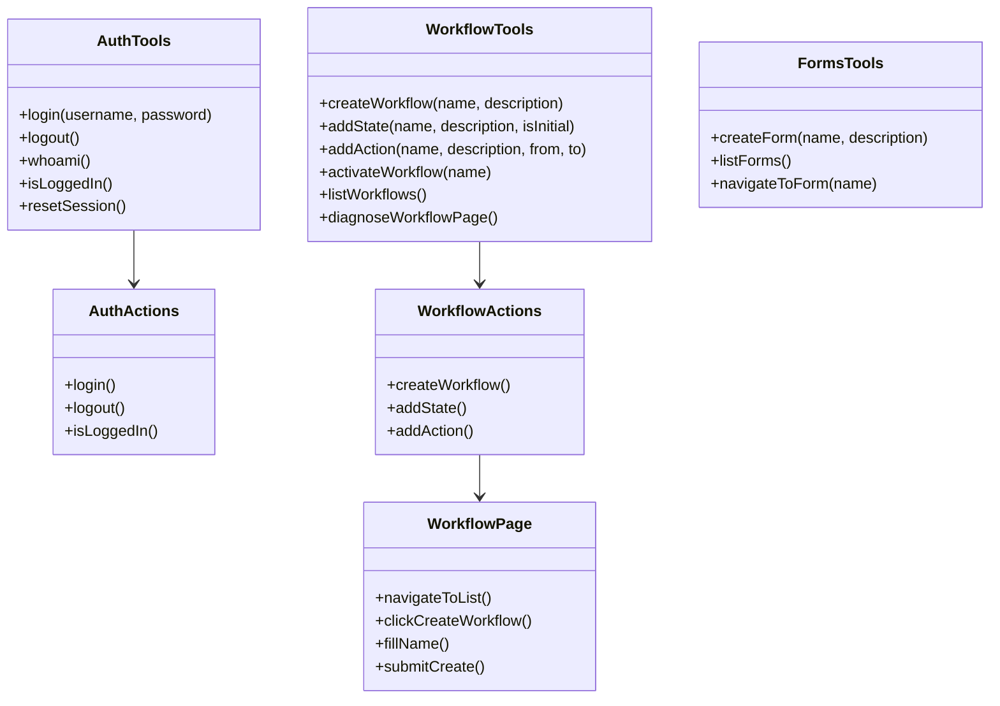
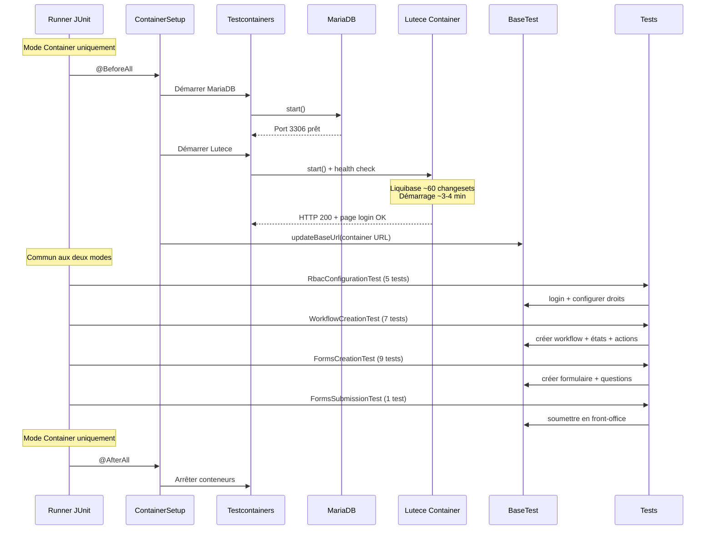

# Lutece E2E Agent

Agent IA conversationnel pour l'automatisation des tests E2E sur Lutece 8, utilisant Playwright et LangChain4j.

## Architecture



## Modules



| Module | Description |
|--------|-------------|
| `lutece-e2e-core` | Page Objects Playwright (CDI + POJO bo) et Actions métier |
| `lutece-e2e-agent` | Service IA LangChain4j et Tools |
| `lutece-e2e-tests` | Tests E2E : CDI + bo3 Playwright direct + Testcontainers (Page Objects dans core) |
| `lutece-e2e-web` | API REST sur OpenLiberty |
| `lutece-e2e-cli` | Interface ligne de commande |

## Flux de traitement



## Installation

### Prérequis

- Java 17+
- Maven 3.8+
- Site Lutece 8 démarré (port 9080)

### Build

```bash
# Cloner le projet
git clone <repo-url>
cd lutece-e2e

# Compiler tous les modules
mvn clean install -DskipTests

# Extraire le driver Playwright (première fois)
cd playwright-driver
npm install
cd ..
```

### Configuration

Créer le fichier `lutece-e2e-web/src/main/liberty/config/server.env` :

```properties
# Azure OpenAI
AZURE_OPENAI_API_KEY=votre-clé
AZURE_OPENAI_ENDPOINT=https://votre-endpoint.openai.azure.com
AZURE_OPENAI_DEPLOYMENT_NAME=gpt-4o

# Lutece cible
LUTECE_BASE_URL=http://localhost:9080/site-deontologie

# Playwright
PLAYWRIGHT_DRIVER_PATH=/chemin/vers/playwright-driver/java/driver/linux/playwright.sh
PLAYWRIGHT_NODEJS_PATH=/chemin/vers/playwright-driver/java/driver/linux/node

# Proxy (si nécessaire)
# Configuré dans jvm.options
```

## Utilisation

### Démarrer le serveur

```bash
cd lutece-e2e-web
mvn liberty:run
```

Le serveur démarre sur `http://localhost:9090/lutece-e2e-web/`

### API REST

```bash
# Envoyer un message à l'agent
curl -X POST http://localhost:9090/lutece-e2e-web/api/agent/chat \
  -H "Content-Type: application/json" \
  -d '{"message": "Connecte toi avec admin/adminadmin et crée un workflow Test"}'
```

### Exemples de commandes

```
# Authentification
"Connecte toi avec admin/adminadmin"
"Déconnecte toi"
"Vérifie si je suis connecté"

# Workflows
"Crée un workflow appelé MonWorkflow avec la description Test"
"Ajoute un état Brouillon comme état initial"
"Ajoute un état Validé"
"Ajoute une action Valider de Brouillon vers Validé"
"Active le workflow MonWorkflow"

# Formulaires
"Liste les formulaires disponibles"
"Crée un formulaire de contact"

# Diagnostic
"Diagnostique la page workflow"
```

## Structure des Tools



## Tests E2E

Le module `lutece-e2e-tests` propose **deux modes d'exécution** selon l'environnement :

### Architecture des tests

```mermaid
graph TB
    subgraph "Mode Instance Existante"
        DEV[Développeur]
        MVN_TEST["mvn test -Dtest=...Suite"]
        JUNIT_EXT[JUnit 5 Suite]
        BASE_EXT[BaseTest - Playwright]
        LUTECE_EXT["Instance Lutece<br/>localhost:9080<br/>(déjà démarrée)"]

        DEV --> MVN_TEST --> JUNIT_EXT --> BASE_EXT --> LUTECE_EXT
    end

    subgraph "Mode Testcontainers Docker"
        CI[CI / Jenkins]
        MVN_VERIFY["mvn verify -Pcontainer-tests<br/>-Dlutece.image=..."]
        FAILSAFE[Failsafe Plugin]
        SETUP[ContainerSetup]
        TC["Testcontainers"]
        MARIADB["MariaDB<br/>(conteneur)"]
        LUTECE_DOCKER["Lutece<br/>(conteneur Docker)<br/>port dynamique"]
        BASE_DOCKER[BaseTest - Playwright]

        CI --> MVN_VERIFY --> FAILSAFE --> SETUP --> TC
        TC --> MARIADB
        TC --> LUTECE_DOCKER
        SETUP --> BASE_DOCKER --> LUTECE_DOCKER
    end

    style DEV fill:#e8f5e9
    style CI fill:#e3f2fd
    style LUTECE_EXT fill:#fff3e0
    style LUTECE_DOCKER fill:#fff3e0
    style MARIADB fill:#fce4ec
```



### Mode Instance Existante (développeur)

Pré-requis : une instance Lutece 8 démarrée et accessible.

```bash
# Suite complète bo3 (22 tests) - RBAC, Workflow, Forms, Soumission FO
mvn test -pl lutece-e2e-tests \
  -Dtest=fr.paris.lutece.e2e.tests.bo.testsuites.WorkflowFormsIntegrationSuite

# Tests CDI existants
mvn test -pl lutece-e2e-tests \
  -Dtest=fr.paris.lutece.e2e.tests.ListFormsTest

# Test standalone (question type text long)
mvn test -pl lutece-e2e-tests \
  -Dtest=fr.paris.lutece.e2e.tests.bo.testsuites.CreationQuestionTypeTextLongTest

# Surcharger l'URL cible
mvn test -pl lutece-e2e-tests \
  -Dtest=fr.paris.lutece.e2e.tests.bo.testsuites.WorkflowFormsIntegrationSuite \
  -Dlutece.base.url=http://mon-serveur:9080/site-deontologie
```

### Mode Testcontainers (CI/Docker)

Aucune instance Lutece préalable requise. Docker (ou Podman) démarre automatiquement MariaDB + Lutece.

```bash
# Suite complète avec conteneurs (23 tests = ContainerSetup + 22 tests)
mvn verify -pl lutece-e2e-tests -Pcontainer-tests \
  -Dlutece.image=nexus-docker-fastdeploy.api.paris.mdp/bild/f98/site-deontologie:1.0.0-SNAPSHOT \
  -Dtest.headless=true
```

### Séquence d'exécution des suites



### Couverture des tests bo3

| Suite de tests | Tests | Couverture |
|---|---|---|
| `RbacConfigurationTest` | 5 | Login admin, droits utilisateur, sélection rôles |
| `WorkflowCreationTest` | 7 | Création workflow, états initial/final, action, tâche |
| `FormsCreationTest` | 9 | Formulaire, étapes, questions (texte, nombre, date, commentaire) |
| `FormsSubmissionTest` | 1 | Soumission front-office + vérification réponse |
| **Total suite** | **22** | **Parcours complet RBAC → Workflow → Forms → FO** |

### Deux patterns de tests

Le module fait cohabiter deux patterns :

| | Tests CDI | Tests bo3 |
|---|---|---|
| **Package** | `fr.paris.lutece.e2e.tests` | `fr.paris.lutece.e2e.tests.bo` |
| **Infrastructure** | `@EnableAutoWeld` + CDI | `BaseTest` + Playwright direct |
| **Page Objects** | CDI depuis `lutece-e2e-core` (`fr.paris.lutece.e2e.pages`) | POJO depuis `lutece-e2e-core` (`fr.paris.lutece.e2e.pages.bo`) |
| **Configuration** | `@Inject @ConfigProperty` | `ConfigProvider.getConfig()` |
| **Conteneurs** | Non | Oui (Testcontainers) |

### Configuration (`config_ordinal`)

Les propriétés MicroProfile Config sont résolues par ordre de priorité :

```
Priorité    Source                          Ordinal
─────────   ──────────────────────────────  ───────
Haute       System properties (-D...)       400
            lutece-e2e-tests config         350
Basse       lutece-e2e-core/agent config    100
```

Cela permet de surcharger via la ligne de commande : `-Dtest.headless=true`, `-Dlutece.base.url=...`

## Développement

### Structure des Page Objects

Le module `lutece-e2e-core` centralise tous les Page Objects Playwright dans deux sous-packages :

```
lutece-e2e-core/src/main/java/fr/paris/lutece/e2e/pages/
├── BasePage.java                  # Base CDI (@Dependent)
├── LoginPage.java                 # CDI - utilisé par les Actions/Tools
├── AdminMenuPage.java             # CDI
├── WorkflowPage.java              # CDI
├── FormsPage.java                 # CDI
└── bo/                            # POJOs Playwright direct
    ├── LoginPage.java             # new LoginPage(page, baseUrl)
    ├── AdminMenuPage.java
    ├── SitePropertiesPage.java
    ├── WorkflowListPage.java
    ├── WorkflowCreationFormPage.java
    ├── WorkflowEditPage.java
    ├── FormsListPage.java
    ├── FormsCreationPage.java
    ├── FormsEditPage.java
    ├── FormsFrontOfficePage.java
    └── FormsResponsesPage.java
```

- **Pages CDI** (`fr.paris.lutece.e2e.pages`) : `@Dependent`, etendent `BasePage`, injectees via CDI dans les Actions
- **Pages POJO bo** (`fr.paris.lutece.e2e.pages.bo`) : instanciees via constructeur `(Page, baseUrl)`, utilisees par les tests bo3

Les deux patterns coexistent dans le meme module core, centralisant tout le code d'interaction Playwright.

### Ajouter un nouveau Tool

1. Créer la Page Object dans `lutece-e2e-core/pages/`
2. Créer l'Action dans `lutece-e2e-core/actions/`
3. Créer le Tool dans `lutece-e2e-agent/tools/`

```java
// 1. Page Object
@Dependent
public class MyPage extends BasePage {
    public MyPage navigateTo() {
        navigate("/jsp/admin/plugins/myplugin/ManageMyFeature.jsp");
        return this;
    }

    public MyPage fillForm(String value) {
        page().locator("input[name='field']").fill(value);
        return this;
    }
}

// 2. Action
@ApplicationScoped
public class MyActions {
    @Inject MyPage myPage;
    @Inject BrowserManager browser;

    public ActionResult<String> doSomething(String param) {
        myPage.navigateTo().fillForm(param);
        return ActionResult.success(param, "Action réussie");
    }
}

// 3. Tool
@ApplicationScoped
public class MyTools {
    @Inject MyActions myActions;

    @Tool("Description de l'action pour l'IA")
    public String doSomething(@P("Description du param") String param) {
        return myActions.doSomething(param).toToolMessage();
    }
}
```

## Dépannage

### Problème de connexion

Si l'agent reste bloqué sur AdminMessage.jsp :
- Vérifier que le site Lutece est démarré
- Vérifier les identifiants (admin/adminadmin par défaut)
- Utiliser `resetSession` pour réinitialiser

### Timeout Playwright

Si les sélecteurs ne trouvent pas les éléments :
- Vérifier que le plugin est installé dans Lutece
- Utiliser `diagnoseWorkflowPage` pour voir les éléments disponibles
- Les sélecteurs Lutece 8 utilisent des composants offcanvas Bootstrap 5

### JDBC sous Podman (`DSRA4000E: No implementations of org.h2.jdbcx.JdbcDataSource`)

Sous Podman, l'auto-detection JDBC de Liberty echoue et retombe sur H2 au lieu de MySQL.
Cela est cause par la feature `persistence-3.1` qui fournit des classes H2 dans le classpath.

`LuteceContainer` corrige cela automatiquement en patchant le `<jdbcDriver>` du `server.xml`
au demarrage du conteneur pour forcer les classes MySQL (`MysqlDataSource`,
`MysqlConnectionPoolDataSource`, `MysqlXADataSource`).

Si le probleme reapparait apres un changement d'image Liberty, verifier :
1. Que le `server.xml` de l'image contient bien `libraryRef="jdbcLib"` dans le `<jdbcDriver>`
2. Que le JAR `mysql-connector-j-*.jar` est present dans `WEB-INF/lib/`
3. Que l'ENTRYPOINT de l'image est bien `/opt/ol/helpers/runtime/docker-server.sh`

### Proxy

Pour les environnements avec proxy, configurer `jvm.options` :
```
-Dhttp.proxyHost=192.168.64.41
-Dhttp.proxyPort=8080
-Dhttps.proxyHost=192.168.64.41
-Dhttps.proxyPort=8080
```

## Technologies

- **Java 17** - Langage
- **Jakarta EE 10** - API Enterprise
- **OpenLiberty 26** - Serveur d'application
- **Playwright 1.41** - Automatisation navigateur
- **LangChain4j 1.0** - Framework IA
- **Azure OpenAI GPT-4o** - Modèle de langage
- **CDI** - Injection de dépendances
- **MicroProfile Config** - Configuration externalisée

## Licence

Projet interne - Ville de Paris
